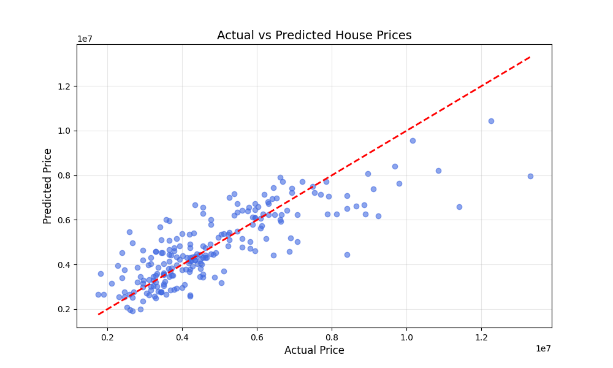

# House Price Prediction using Linear Regression

This project uses a Linear Regression model to predict house prices based on features such as area, number of bedrooms, location attributes, and more from the `Housing.csv` dataset.

## Dataset

The dataset used in this project is `Housing.csv`, which contains various features about houses including:

- Area (in sq ft)
- Number of bedrooms, bathrooms, stories
- Whether it is on the main road
- Whether it has a guestroom, basement, hot water heating, air conditioning
- Preferred area or not
- Furnishing status (furnished/semi/unfurnished)
- **Price** (Target)

## Steps Performed

### 1. **Data Loading & Exploration**
- Loaded the dataset using `pandas`
- Performed basic **EDA (Exploratory Data Analysis)**:
  - `info()`: structure and datatypes
  - `isnull()`: checked missing values
  - `describe()`: statistical summary

### 2. **Preprocessing**
- Applied **Label Encoding** to convert categorical columns to numerical format:
  - `mainroad`, `guestroom`, `basement`, `hotwaterheating`, `airconditioning`, `prefarea`, `furnishingstatus`

### 3. **Model Building**
- Split data into **training and test sets** (60% train, 40% test)
- Trained a **Linear Regression** model on the training set

### 4. **Model Evaluation**
Used standard regression metrics:
- **MAE (Mean Absolute Error)**
- **MSE (Mean Squared Error)**
- **R² Score (Accuracy)**

### 5. **Visualization**
- Plotted **Actual vs Predicted House Prices**
- The red dashed line represents the ideal scenario (perfect prediction)
- Blue scatter points represent actual vs predicted values

## Technologies Used

- Python 
- Pandas
- NumPy
- scikit-learn
- Matplotlib

